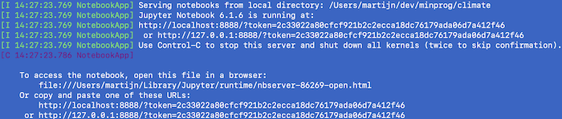
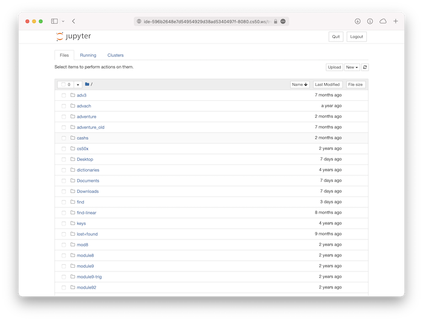
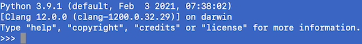
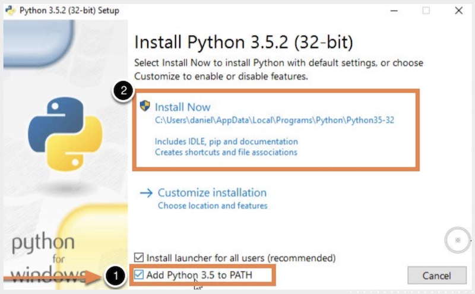

# Installatie van Python en Jupyter

Je gaat vanaf nu werken op je eigen laptop, in plaats van via de CS50 IDE.
Volg deze stappen om te kijken of Python en Jupyter goed geinstalleerd is, en zonodig om te installeren.

# Korte versie

Voor experts hier de korte versie:

- Zorg dat Python 3.x geïnstalleerd is.
- Zorg dat het package `notebook` geïnstalleerd is.
- Check of je `jupyter notebook` kunt starten via de command line.

# Uitgebreide versie

## 1. Check Jupyter Notebook

Kijk of Python al geinstalleerd is in de terminal:

- **Windows**  Open de "command line" of "opdrachtprompt" ([WikiHow](https://nl.wikihow.com/De-opdrachtprompt-openen-in-Windows))

- **Mac**  Open de "terminal" ([WikiHow](https://www.wikihow.com/Open-a-Terminal-Window-in-Mac))

Geef daar het commando:

        jupyter notebook

✅ Krijg je nu een uitvoer zoals de volgende? Dan is alles goed geinstalleerd.

Kopieer dan de link in het scherm (met `localhost` erin) en open deze in je webbrowser. Het moet er ongeveer zo uitzien:

In dat geval ben je klaar met dit stappenplan en kun je door naar de opdracht.

❌ Krijg je een foutmelding dat het niet gevonden kan worden? Dan is `jupyter` waarschijnlijk niet geinstalleerd. Ga dan naar stap 2. Weet je het niet zeker, check dan even met een medestudent die veel ervaring met computers heeft.

## 2. Check Python3

Open weer de command line of terminal. Geef dan het volgende commando:

    python3

✅ Krijg je zoiets als hieronder? Dan is Python wel al goed geïnstalleerd.

Stop Python door het commando `exit()` te geven (met haakjes!), en ga naar stap 4 om Jupyter te installeren.

❌ Krijg je een foutmelding dat het niet gevonden kan worden? Ga dan naar stap 3.

## 3. Check Python

Open weer de command line of terminal. Geef dan het volgende commando:

    python

✅ Krijg je zoiets als hieronder? Dan is Python wel al goed geïnstalleerd. Check zéér nauwkeurig of er staat dat het Python **3** is. Dus er staat bijvoorbeeld `Python 3.8.1`, `Python 3.7.4` of `Python 3.9.1`.

Stop Python door het commando `exit()` te geven (met haakjes!), en ga naar stap 4 om Jupyter te installeren.

❌ Is het de verkeerde versie van Python (versie `2.7` bijvoorbeeld) of krijg je een foutmelding dat het niet gevonden kan worden? Ga dan naar stap 5.

## 4. Installeer Jupyter notebook

Geef het volgende commando om Jupyter Notebook te installeren:

    pip3 install notebook seaborn

Krijg je een melding dat `pip3` niet gevonden kan worden, probeer dan:

    pip install notebook seaborn

Dit kan even duren omdat er software gedownload moet worden. Naderhand kun je kijken of het werkt met het commando:

    jupyter notebook

✅ Gelukt? Kopieer dan de link in het scherm (met `localhost` erin) en open deze in je webbrowser. Het moet er ongeveer zo uitzien:

In dat geval ben je klaar met dit stappenplan en kun je door naar de opdracht.

❌ Gaat dit mis? Ga naar stap 5.

## 5. Kom maandag om 9 uur Python installeren

Als je hier bent uitgekomen moet waarschijnlijk Python nog geinstalleerd worden. Je kunt het zelf proberen (als je Windows hebt) maar als het niet lukt moet je maandag om 9 uur langskomen voor hulp!

**Alleen voor Windows** Ga naar de website van [Python](https://www.python.org/downloads/release/python-396/) en installeer de Windows Installer (64-bit). Let op dat je het vinkje **Add Python 3.9 to PATH** aanzet!!

**Alleen voor Mac** Python zou wel degelijk geïnstalleerd moeten zijn, dus dan moeten we uitvogelen wat er aan de hand is.

✅ Gelukt? Ga dan terug naar stap 4.

❌ **Niet gelukt? Kom maandag om 9 uur naar lokaal A1.22 op Science Park zodat je binnen een uur Python werkend hebt.**
